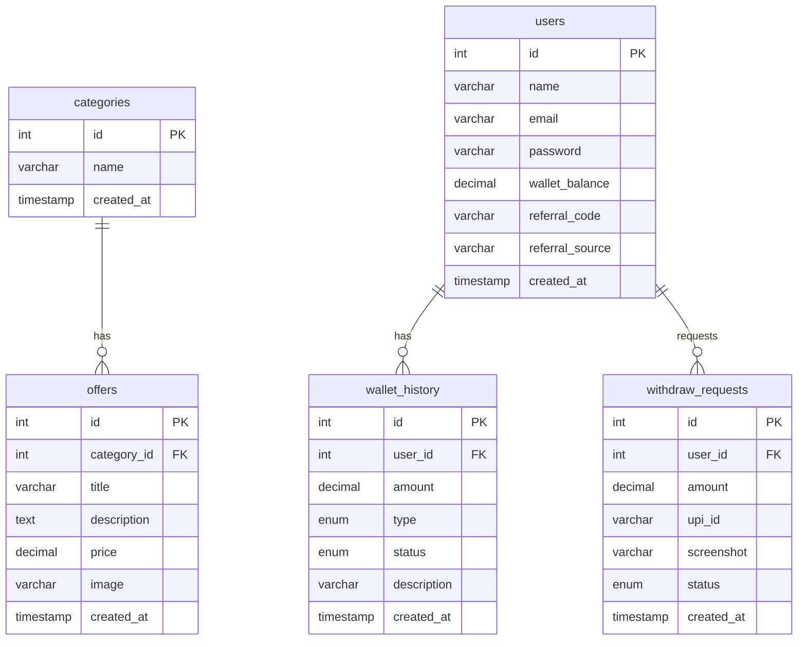

# KamateRaho Database Schema

## Entity Relationship Diagram

## Table Descriptions

### categories
Stores the different offer categories.
- **id**: Primary key
- **name**: Category name (e.g., "Amazon - Top Deals")
- **created_at**: Timestamp when category was created

### users
Stores user account information.
- **id**: Primary key
- **name**: User's full name
- **email**: User's email address (unique)
- **password**: Hashed password
- **wallet_balance**: Current wallet balance
- **referral_code**: Referral code for tracking referrals
- **referral_source**: Source platform where user came from (youtube, facebook, instagram, twitter, other)
- **created_at**: Timestamp when user registered

### offers
Stores individual offers within categories.
- **id**: Primary key
- **category_id**: Foreign key to categories table
- **title**: Offer title
- **description**: Detailed offer description
- **price**: Offer price
- **image**: Path to offer image
- **created_at**: Timestamp when offer was created

### wallet_history
Tracks all wallet transactions.
- **id**: Primary key
- **user_id**: Foreign key to users table
- **amount**: Transaction amount
- **type**: Either "credit" or "debit"
- **status**: Either "pending", "approved", or "rejected"
- **description**: Transaction description
- **created_at**: Timestamp when transaction was created

### withdraw_requests
Tracks user withdrawal requests.
- **id**: Primary key
- **user_id**: Foreign key to users table
- **amount**: Withdrawal amount
- **upi_id**: User's UPI ID for transfer
- **screenshot**: Path to uploaded screenshot
- **status**: Either "pending", "approved", or "rejected"
- **created_at**: Timestamp when request was created